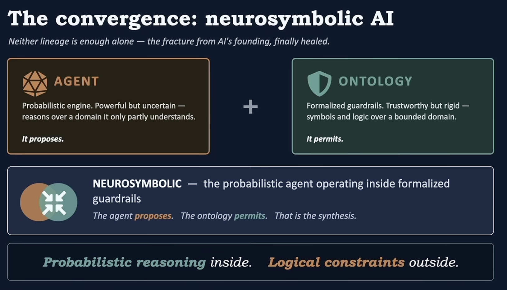

# Design Notes: Open Questions & Future Directions

This module is an exploration, not a finished library. It proves the mechanism —
lift LLM JSON output into RDF, check it with SHACL + OWL reasoning, retry with
feedback — works end-to-end against a live model. Getting it past "demo" would mean
resolving the open questions below. Each one is a real design fork, not a bug; this
document exists so the tradeoffs don't have to be re-derived from scratch next time.

See [`README.md`](README.md) for what the module does today and how to run it.

Every open question below is really the same tension playing out at a different
layer: how much of "the ontology permits" should live in-process vs. in a shared
store (§1), how much should be taught proactively vs. enforced reactively (§2), how
much can be generated vs. must stay hand-modeled (§3, §7), and where the boundary
between the stateless guardrail and the stateful application should sit (§4, §5).

---

## 1. Scaling the background knowledge graph

**Problem.** `OntologyValidationAdvisor` loads the background ontology + facts into
an in-memory Jena `Model` once, then on *every single validation call* copies the
whole thing into a fresh combined graph and re-runs the full OWL reasoner's closure
over it (see [`OntologyValidationAdvisor.java`](src/main/java/com/example/demo/OntologyValidationAdvisor.java),
`validate()`). At demo scale (a dozen background triples) this is free. It won't stay
free — real background knowledge (every customer, every rep, every historical order)
means growing heap footprint and reasoning time that's almost entirely wasted
re-deriving facts that didn't change since the last call.

**Why it matters.** This is the piece most likely to break first if the module is
taken beyond a demo, and it's the deepest architectural question here: Jena separates
*storage* scaling from *reasoning* scaling, and they don't solve the same way.

**Options considered:**

| Option | Solves | Doesn't solve | Notes |
|---|---|---|---|
| Keep in-memory `Model` (status quo) | Nothing extra | Heap + redundant reasoning | Fine only while background facts stay small |
| Swap to **TDB2** (Jena's native disk-backed, indexed store) | Persistence, heap footprint, dataset size | Reasoning cost | Same `Graph`/`Model` API, so the SHACL/OWL-calling code barely changes — but requires wrapping access in TDB2 transactions, which the current code doesn't do anywhere |
| Point at **Fuseki** (Jena's SPARQL server) instead of an embedded store | The above, plus lets multiple app instances share one background KB instead of each holding a private in-heap copy | Reasoning cost | Real operational win independent of raw scale — relevant even before triple counts get large |
| **`RDFConnection`** to a third-party SPARQL store (GraphDB, Stardog, Neptune, Blazegraph, Virtuoso, ...) | Persistence, scale, *and* reasoning if the store has native inference | New dependency, new failure mode (network) | The only option here where "OWL reasoning at scale" isn't Jena's problem to solve — several enterprise stores compute OWL-RL-style inference incrementally at index time |
| **`Reasoner.bindSchema(backgroundModel)`** once at construction, `.bind()` only the small candidate graph per call | Redundant re-reasoning over the *unchanging* background portion | Storage/heap scale | Cheapest fix, no storage-backend change, attacks the actual waste in today's code |
| Pre-materialize the ontology's closure into the store (offline/scheduled job), reason only over deltas at request time | Reasoning cost at request time | Requires an offline pipeline + staleness handling | Matches Jena community guidance — see below |

**A finding worth being explicit about:** wrapping a live Jena rule-based reasoner
(RDFS or OWL) directly around a TDB2-backed model is a documented source of real
friction once the dataset grows — the Jena user community has hit `"Iterator used
inside a different transaction"` failures and degraded query behavior at scale,
because the forward-chaining reasoners assume fast in-memory graph access, not
TDB2's transactional/indexed access pattern. The community's own recommendation is
to **pre-materialize the inferred closure once and persist the derived triples**
rather than live-wrapping a reasoner around a large persistent store. In other
words: swapping the storage backend alone does not fix the reasoning-cost problem;
they need separate solutions.

**Recommendation, in order:**
1. `bindSchema()` first — small, local, no infra change, removes the actual
   redundant work happening today.
2. Move to TDB2 / Fuseki once the background KB needs to be shared across app
   instances or exceed in-memory scale — but only for storage/sharing, not as a fix
   for reasoning cost.
3. Only reach for a third-party reasoning-capable store (via `RDFConnection`) if the
   OWL-reasoning workload itself, not just storage, becomes the bottleneck — that's
   the point where trying to make Jena's own reasoner scale stops being the right
   fight.

---

## 2. Retry feedback quality: the model doesn't know what to fix

**Problem.** Observed live (see README's "Verified Against a Live Model"): prompted
to refund a support rep, the model produced the same violation on all 4 attempts
(initial + 3 retries). The OWL reasoner correctly rejected every one — but the model
never self-corrected to a valid customer ID within the retry budget.

**Why it matters.** The retry-with-feedback loop only works if the feedback is
*actionable*. The current failure message surfaces the reasoner's raw diagnostic —
`"Individual a member of disjoint classes"` — which tells the model the graph is
inconsistent but not what a valid answer would look like. SHACL's `sh:message`
strings are already human/LLM-authored and reasonably actionable; the OWL reasoner's
`ValidityReport.Report.getDescription()` is not — it's Jena's internal diagnostic
language, not written for LLM consumption.

**Options considered:**
- **Post-process OWL violations into corrective messages** — e.g. detect the
  "disjoint classes" pattern and rewrite it as "`recipientId` must reference a known
  Customer (cust-1001, cust-2002), not a support representative." Requires mapping
  reasoner output back to domain-meaningful terms, which is itself non-trivial
  (the reasoner reports IRIs and class names, not "why this matters here").
  Given this Java advisor currently hardcodes the domain in resource files. Perhaps 
  we can use another LLM call, to "compile" the semantic domain gaps into meaningfull errors.
- **Proactively state the constraint in the system prompt** instead of relying on
  reactive correction — e.g. explicitly tell the model "refunds may only go to
  customers, never to support staff" up front. Cheaper, but duplicates the ontology's
  knowledge in prose, which drifts from the ontology over time.
- **Cap retries and fail closed with a clear error** (already implemented via
  `OntologyValidationException`) rather than assume convergence — accept that some
  violations need a human in the loop rather than more retries.

**Recommendation:** don't rely on retries alone to teach the model the ontology's
constraints in real time. Treat the system prompt as the primary teaching mechanism
(cheap, already partially done in `DemoApplication`) and the retry loop as a
backstop for occasional mistakes, not a substitute for stating the rules. Improving
OWL violation messages to be more corrective is worth doing but has a low ceiling —
some violations (e.g. "these two graph regions are jointly inconsistent") don't
reduce to a simple "do X instead" sentence.

---

## 3. Ontology/shapes/context authoring burden

**Problem.** The domain ontology, SHACL shapes, and JSON-LD context are all
hand-authored per domain — nothing here generates them from the Java record type
the way `StructuredOutputValidationAdvisor` auto-generates a JSON Schema from
`outputType(Class)`.

**Why it matters.** This is exactly the "who maintains the ontology?" question
Frank Coyle's talk itself raises as unresolved. It's not a defect to fix so much as
a cost to acknowledge honestly.

**Options considered:**
- **Generate a starter JSON-LD context** from the record's field names/types by
  naming convention (e.g. auto-map `String fooId` fields to `@id`-coerced terms).
  Removes boilerplate but doesn't remove the actual modeling work — someone still
  has to decide the domain/range/disjointness axioms, which is the part that
  actually catches errors.
- **Ship reusable shape templates** for common patterns (enum-valued field,
  max-cardinality-per-parent, class-membership-of-reference) so authoring a new
  domain's SHACL file is closer to filling in a template than writing SHACL from
  scratch.
- **Accept this as inherent, not solvable by tooling** — the ontology *is* the
  domain knowledge; generating it from the output type would just be generating a
  weaker JSON Schema with extra steps.

**Recommendation:** templates for the SHACL layer (structural checks are more
formulaic and reusable across domains) are worth building if this sees a second
domain. The OWL/TBox layer resists templating — it's where the actual domain
expertise has to live, and that's fine; it's supposed to.

---

## 4. Cross-turn / stateful checks

**Problem.** The SHACL cardinality check ("at most one refund per order") only sees
the single response being validated in isolation. It has no memory of refunds issued
in earlier turns of the same conversation, so true duplicate-refund detection across
turns isn't implemented.

**Options considered:**
- **Feed prior decisions into the background graph per session** — e.g. a
  chat-memory-backed store of previously-issued refunds, merged into `combined`
  alongside the static background facts before validation. Correct, but ties the
  advisor to session/memory infrastructure it doesn't currently depend on.
- **Track issued refunds via a side-channel** (e.g. logging tool-call results into a
  small per-conversation store) and merge at validation time. Similar shape to the
  above, less coupling to a specific chat-memory implementation.
- **Treat this as out of scope for the advisor** — cross-turn consistency is
  arguably an application-level concern (the calling code owns "has this refund
  already been issued?"), not something a stateless per-call guardrail should own.

**Recommendation:** don't build this into the advisor itself. If cross-turn dedup is
needed, the cleaner boundary is: the *application* maintains the "refunds issued so
far" graph (from its own persistence, not the advisor's), and passes it in as
additional background facts per call — keeping `OntologyValidationAdvisor` stateless
and reusable across call sites.

---

## 5. Composability with other guardrail advisors

**Problem.** Both `OntologyValidationAdvisor` and Spring AI's built-in
`StructuredOutputValidationAdvisor` implement their own retry-around loop (each
calls `callAdvisorChain.copy(this).nextCall(...)` in a `for` loop). Chaining them
naively on the same `ChatClient` call means an outer retry could re-trigger an inner
advisor's full retry budget on every outer attempt — attempts multiply rather than
add, and neither advisor knows the other exists.

**Options considered:**
- **Merge into one advisor** with a single retry loop that checks both JSON Schema
  and ontology validity per attempt. Removes the nesting problem entirely but
  couples the two concerns Coyle's talk deliberately keeps separate ("Pydantic at
  the door, ontology at the ledger" as two distinct layers).
- **Document a composition convention**: only one advisor in a chain owns retries;
  others run once and fail fast (no internal retry) if invoked as inner advisors.
  Needs an explicit "am I the retrying one" configuration knob that doesn't exist on
  either advisor today.
- **Leave uncomposed for now** — the current demo runs `OntologyValidationAdvisor`
  alone, deliberately sidestepping this rather than solving it.

**Recommendation:** worth raising with the Spring AI advisor design more broadly
(this isn't specific to this module — any two retry-loop advisors chained together
have this problem). Not something to solve unilaterally inside
`OntologyValidationAdvisor`.

---

## 6. Streaming support

**Problem.** `adviseStream` throws `UnsupportedOperationException` unconditionally.

**Options considered:**
- **Buffer the full stream, validate, then replay** — technically possible but
  defeats the point of streaming (no output reaches the caller until validation
  completes anyway, so latency is the same as non-streaming with extra complexity).
- **Validate only after stream completion, accept the latency**, i.e. functionally
  identical to the previous option without pretending otherwise.
- **Leave unsupported and document it** — current state. Honest about the
  limitation given RDF/SHACL/OWL validation fundamentally needs the complete output.

**Recommendation:** leave as-is. Structural/semantic validation of a JSON document
is not meaningfully streamable — this isn't a gap worth investing in closing.

---

## 7. Generalizing the JSON→RDF lifting configuration

**Problem.** `rootType(String)` and `arrayFieldType(fieldName, typeIri)` are set
manually per domain in the builder, unlike `StructuredOutputValidationAdvisor`,
which derives its JSON Schema automatically from `outputType(Class)`.

**Options considered:**
- **Infer `@type` injection points from the JSON-LD context itself** — the context
  already knows which fields are node-typed (via nested `@context` blocks like
  `refunds`'s), so the advisor could in principle walk the context to find array
  fields that need per-element typing instead of requiring `arrayFieldType()` calls.
  Would remove a manual step without removing any actual modeling decision.
- **Accept the manual wiring** — mapping JSON structure to ontology types is a
  modeling decision (which class does this array's elements belong to?), and making
  it implicit risks silently wrong inferences for anyone extending this to a new
  domain.

**Recommendation:** the context-inspection approach (first option) is a reasonable,
low-risk simplification worth doing if this module gets a second domain to prove the
pattern generalizes — but not urgent at one domain.

---

## Suggested priority if this graduates past exploration

1. `Reasoner.bindSchema()` (§1) — cheap, fixes real waste, no infra change.
2. System-prompt-first framing over retry-reliance (§2) — cheap, addresses the
   actual live failure observed.
3. SHACL shape templates (§3) — pays off as soon as a second domain exists.
4. Everything else — revisit if/when the module needs to leave single-domain,
   single-instance, demo scale.
