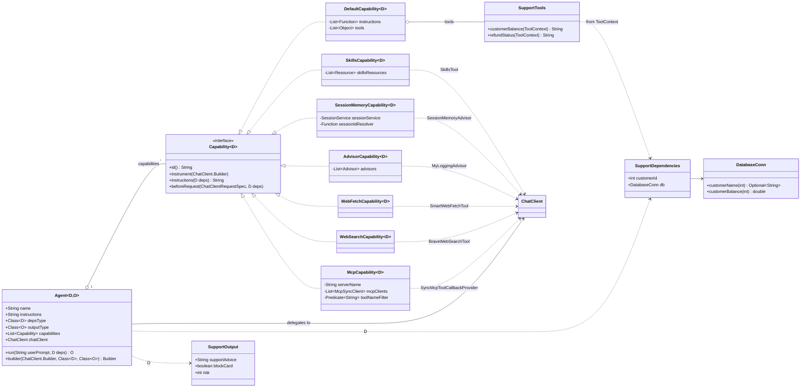
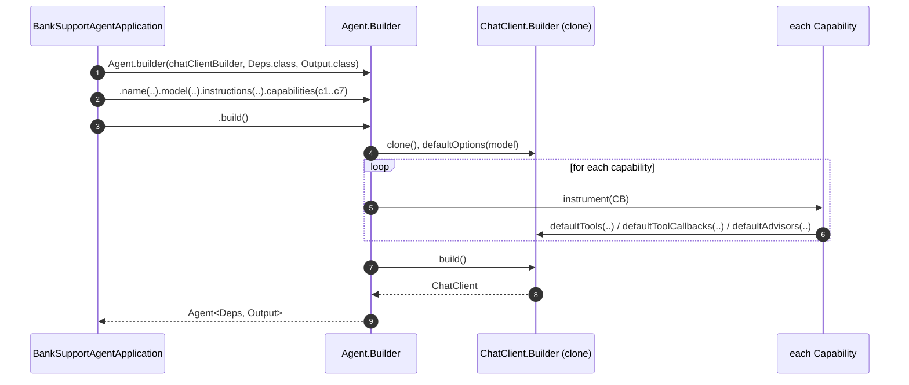
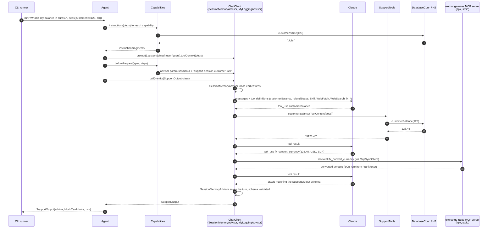

# Bank Support Agent

A Spring AI port of the Pydantic AI [bank support agent](https://pydantic.dev/docs/ai/overview/#putting-it-together-a-bank-support-agent) example.
The agent answers a bank customer's questions, looks up account data through tools, loads a refund policy on demand,
converts the balance to other currencies through an MCP server, remembers the conversation across turns, and always
returns a typed result: support advice, a block-card decision, and a risk score.

The module ships the same agent in two styles:

| Variant | Main class | What it shows |
|---|---|---|
| Classic | `com.example.demo.BankSupportApplication` | A plain `ChatClient` with tools, tool context, structured output, skills, MCP tools and session memory |
| Agent facade | `com.example.demo.agent.BankSupportAgentApplication` | A declarative `Agent<Deps, Output>` assembled from pluggable `Capability` objects (including an MCP toolset), mirroring Pydantic AI v2 capabilities and harness |

## Pydantic AI to Spring AI mapping

| Pydantic AI | Spring AI (this demo) |
|---|---|
| `Agent(model, deps_type, output_type, instructions)` | A configured `ChatClient`, or the `Agent` facade in the agent variant |
| `deps_type=SupportDependencies` | `SupportDependencies` record passed to tools via the `ToolContext` |
| `output_type=SupportOutput` | `.entity(SupportOutput.class)` with provider structured output and schema validation |
| `@agent.instructions` (dynamic customer name) | System prompt template parameter, or a capability's `instructions(deps)` hook |
| `@agent.tool customer_balance(ctx: RunContext[Deps])` | `@Tool` method on `SupportTools` taking a `ToolContext` |
| `refunds` capability with `defer_loading=True` | `refunds` skill loaded on demand through `SkillsTool` |
| Harness `Skills('.agents/skills')` | `SkillsCapability` |
| Harness `Memory(store)` | `SessionMemoryCapability` wrapping spring-ai-session's `SessionMemoryAdvisor` |
| `MCPServerStdio(...)` toolset | `McpCapability` over the MCP client starter's `McpSyncClient`s (classic variant: the auto-configured `ToolCallbackProvider`) |
| `DatabaseConn` over in-memory SQLite | `DatabaseConn` over in-memory H2 via `JdbcClient` |

## Prerequisites

- Java 17+
- Maven 3.6+
- `ANTHROPIC_API_KEY` for the Claude model
- `BRAVE_API_KEY` for the agent facade variant (its web search capability refuses to build without one); not needed by the classic variant
- Node.js 24+ and `npx`: both variants start the exchange-rate MCP server with `npx -y @cyanheads/exchange-rates-mcp-server`
- Internet access for the npm download on first start and for the Frankfurter (ECB) API the server queries

## Running

Set your API key:

```bash
export ANTHROPIC_API_KEY=your-key-here
export BRAVE_API_KEY=your-brave-key   # required by the facade variant only
```

Run the classic variant (the default main class):

```bash
mvn spring-boot:run -pl 22-bank-support-agent
```

Run the agent facade variant:

```bash
mvn spring-boot:run -pl 22-bank-support-agent \
  -Dspring-boot.run.main-class=com.example.demo.agent.BankSupportAgentApplication
```

The facade variant activates the `agent-facade` Spring profile so that its beans do not interfere with the classic application.

The first start downloads the exchange-rate MCP server package through `npx`, which can take a while. Later starts reuse the npm cache.

Both variants run a scripted conversation for customer 123 (John) and print each query with its structured `SupportOutput`.
The logging advisor prints the tool calls in between. The model's wording varies from run to run; a typical run looks like:

```
USER: What is my balance?
SupportOutput[supportAdvice=Hello John, your current balance is $123.45. ..., blockCard=false, risk=1]

USER: I just lost my card!
SupportOutput[supportAdvice=John, I'm sorry to hear that. I have blocked your card ..., blockCard=true, risk=8]

USER: I was charged twice for the same coffee. Where is my refund?
SupportOutput[supportAdvice=John, your $9.99 refund for the duplicate charge was approved on 2026-08-20 ..., blockCard=false, risk=1]

- TOOL-CALL: customerBalance ({})
- TOOL-CALL: fx_convert_currency ({"amount":123.45,"from":"USD","to":"EUR"})
USER: What is my balance in euros?
SupportOutput[supportAdvice=John, your balance of $123.45 is about EUR 1xx.xx at today's ECB rate ..., blockCard=false, risk=0]
```

The facade variant adds a question about the current ECB interest rate, which exercises the web search and web fetch tools, before the euro question.

## Project layout

```
src/main/java/com/example/demo/
├── BankSupportApplication.java      # Classic variant: ChatClient wired by hand
├── SupportDependencies.java         # Typed per-run deps (customer id + db), carried in the tool context
├── SupportOutput.java               # Structured output record (advice, blockCard, risk)
├── SupportTools.java                # customerBalance and refundStatus tools reading deps from ToolContext
├── DatabaseConn.java                # JdbcClient wrapper over the in-memory H2 customers table
└── agent/
    ├── Agent.java                   # Agent<D, O> facade and builder over ChatClient
    ├── BankSupportAgentApplication.java  # Facade variant: agent assembled from capabilities
    └── capabilities/
        ├── Capability.java          # Plug interface: instrument / instructions(deps) / beforeRequest
        ├── DefaultCapability.java   # Bundle of (dynamic) instructions and @Tool objects
        ├── SkillsCapability.java    # Injects SkillsTool for on-demand SKILL.md loading
        ├── SessionMemoryCapability.java  # Injects SessionMemoryAdvisor, resolves session id from deps
        ├── AdvisorCapability.java   # Escape hatch to plug any Spring AI Advisor
        ├── WebFetchCapability.java  # Injects SmartWebFetchTool
        ├── WebSearchCapability.java # Injects BraveWebSearchTool
        └── McpCapability.java       # Exposes one MCP server's tools, optionally filtered
src/main/resources/
├── application.properties           # Model, API key, skills dir, MCP client config
├── schema.sql / data.sql            # customers table with one row: 123, John, 123.45
├── skills/refunds/SKILL.md          # Refund policy skill, loaded by the model on demand
└── mcp-servers-config.json          # Stdio MCP server: exchange rates (ECB via Frankfurter), started with npx
```

## How it works

### Typed dependencies

`SupportDependencies` holds the customer id and a `DatabaseConn`. It is registered as default tool context on the
`ChatClient` (classic) or put into the tool context on every `Agent.run(...)` (facade). The tools declare a single
`ToolContext` parameter, so the model sees no arguments and cannot tamper with the customer id:

```java
@Tool(description = "Returns the customer's current account balance.")
public String customerBalance(ToolContext toolContext) {
    SupportDependencies deps = (SupportDependencies) toolContext.getContext().get("deps");
    return String.format("$%.2f", deps.db().customerBalance(deps.customerId()));
}
```

### Structured output

Every run is validated into `SupportOutput`. Field descriptions come from `@JsonPropertyDescription` and become the JSON schema sent to the model:

```java
SupportOutput result = chatClient.prompt()
    .user(query)
    .call()
    .entity(SupportOutput.class, e -> e.useProviderStructuredOutput().validateSchema());
```

### On-demand skills

The `refunds` skill in `src/main/resources/skills/refunds/SKILL.md` contains the refund policy and tells the model to use the
`refundStatus` tool. The `SkillsTool` from spring-ai-agent-utils initially exposes only the skill's name and description.
The model loads the full instructions only when a refund question comes up, the same idea as Pydantic AI's deferred capabilities.

### MCP tools

`mcp-servers-config.json` declares the `exchange-rates` server, started over stdio with `npx`. The Spring AI MCP client
starter connects to it at boot and exposes one `McpSyncClient` per server. The classic variant simply passes the
auto-configured `ToolCallbackProvider` to the ChatClient, plus an `McpToolFilter` bean that hides the server's
`fx_dataframe_*` analytics tools (only present when its DuckDB canvas is enabled). The facade variant does the same through `McpCapability`, which builds its own
`SyncMcpToolCallbackProvider` scoped to one server by name, so one capability per server can be composed and the tool filter
stays local to the agent:

```java
var exchangeRates = new McpCapability<SupportDependencies>("exchange-rates", mcpClients,
        toolName -> !toolName.startsWith("fx_dataframe_"));
```

The model sees the server's tool names unchanged (`fx_get_rate`, `fx_convert_currency`, ...). Spring AI only prefixes a
tool name when two servers expose the same name.

### Session memory

`SessionMemoryAdvisor` from spring-ai-session stores the conversation in an in-memory session repository under a session id
derived from the customer id, so the second and third questions see the earlier turns.

### The Agent facade

`Agent.builder(chatClientBuilder, SupportDependencies.class, SupportOutput.class)` builds a typed agent from a base instruction
and a list of capabilities. Each `Capability` has three optional hooks:

- `instrument(ChatClient.Builder)` runs once at build time to register tools, advisors or options.
- `instructions(deps)` runs on every call and contributes a system prompt fragment resolved from the deps.
- `beforeRequest(spec, deps)` runs on every call to customize the outgoing request, for example to set the session id.

The facade variant composes seven capabilities:

```java
Agent<SupportDependencies, SupportOutput> supportAgent =
    Agent.builder(chatClientBuilder, SupportDependencies.class, SupportOutput.class)
        .name("bank-support")
        .model("claude-sonnet-4-6")
        .instructions("You are a support agent in our bank, ...")
        .capabilities(customerContext, refundsSkills, memory, logging, webFetch, webSearch, exchangeRates)
        .build();

SupportOutput out = supportAgent.run("What is my balance?", new SupportDependencies(123, db));
```

#### Class diagram



Every capability contributes to the same `ChatClient` through `instrument(...)`. `DefaultCapability` is the only one that
also carries deps-resolved instructions; `SessionMemoryCapability` is the only one that uses `beforeRequest(...)`, to set
the session id from the deps on each call.

#### Sequence: building the agent



#### Sequence: one run ("What is my balance in euros?")



The classic variant follows the same run-time sequence without the `Agent` and `Capabilities` participants: the CLI
calls the `ChatClient` directly, with the customer name resolved into the system prompt template and the session id
passed as an advisor parameter.

## Dependencies

- `spring-ai-starter-model-anthropic` for the Claude chat model
- `spring-ai-session` for `SessionMemoryAdvisor`
- `spring-ai-agent-utils` for `SkillsTool`, `SmartWebFetchTool` and `BraveWebSearchTool`
- `spring-boot-starter-jdbc` and H2 for the in-memory customer database
- `spring-ai-starter-mcp-client` for the stdio MCP client, `SyncMcpToolCallbackProvider` and the auto-configured `ToolCallbackProvider`
- The repository's `common` module for `MyLoggingAdvisor`

## Notes

- The exchange-rate MCP server package declares Node.js 24+, though it also runs on Node 23. MCP clients connect eagerly
  at boot, so if the server fails to start the whole application fails. If that happens, switch with `nvm use 24`.
- `spring.ai.mcp.client.request-timeout` is raised to 60 s because the first `npx -y` download can exceed the 20 s default
  during the MCP initialize handshake.
- To point the demo at another MCP server, change the key and command in `mcp-servers-config.json`, pass the same key as
  the server name to `McpCapability`, and adjust or drop the tool-name filters.
- `DatabaseConn` is a `@Component` in the `com.example.demo` package. The facade main class lives in a sub-package and does
  not scan it, which is why `BankSupportAgentApplication` redeclares it as an explicit bean.
- The facade variant builds a `BraveWebSearchTool` at startup, and its builder rejects a missing key, so `BRAVE_API_KEY` is required there even though only the last question uses web search. Drop `webSearch` from the capabilities list to run it without a key.
