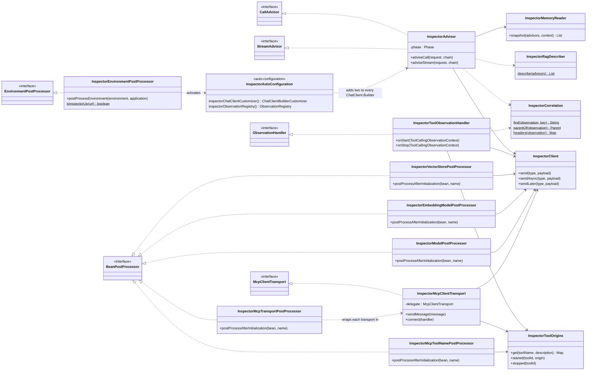
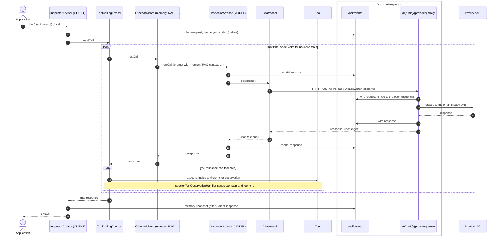
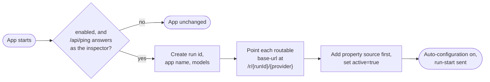
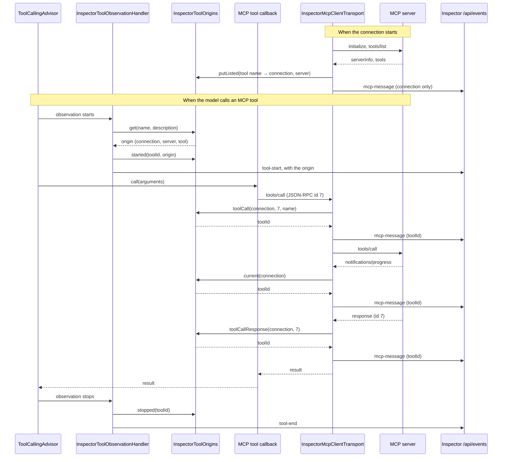

# Spring AI Inspector Starter

Auto-configured instrumentation that reports what a Spring AI application does to a running
[Spring AI Inspector](../README.md). The inspector records:

- ChatClient calls and the prompt as each advisor leaves it.
- Model round-trips, both on the HTTP wire and in the JVM.
- Image, speech, transcription and moderation calls, with their media.
- Tool runs.
- Vector store adds and searches.
- Embedding calls.
- MCP messages.
- Memory contents.

The starter follows three rules:

- **No code changes.** Everything hooks in through Spring Boot extension points. The app keeps its
  `ChatClient`, models, tools and stores as they are.
- **Inactive unless an inspector is reachable.** Without one, nothing is registered and nothing is rerouted.
- **Never breaks or slows the app.** Events are built lazily inside a guard. A failure while describing a call
  drops that event, never the app's call. An unreachable inspector pauses publishing.

It needs only `spring-ai-client-chat` and Spring Boot auto-configuration. It has no web stack: events are posted
with the JDK `HttpClient`. `spring-ai-vector-store`, `spring-ai-mcp` and `spring-ai-autoconfigure-mcp-client-common`
are optional and are used only when the app has them.

## How it hooks in

### Structure

Each instrumentation class implements a Spring, Spring AI, Micrometer or MCP extension point. All of them report
through one `InspectorClient`.



### One ChatClient call

This is the event flow of a call in which the model asks for a tool. Spring AI's `ToolCallingAdvisor` runs the
tool-calling loop inside the advisor chain, so the advisors after it, including the `MODEL` advisor, run once per
model round-trip.



### Summary

| Mechanism | Spring extension point | What it sees | Events |
|---|---|---|---|
| [Detection and routing](#1-detection-and-traffic-routing) | `EnvironmentPostProcessor` (`spring.factories`) | the inspector, the providers' base URLs, the configured models | `run-start`, `run-end` |
| [Recording proxy](#2-the-recording-proxy) | rewritten `spring.ai.<provider>.base-url`, correlation headers via `RestClientCustomizer` / `WebClientCustomizer` / the SDKs' `*HttpClientBuilderCustomizer` | every HTTP request and response to a model provider | `wire-request`, `wire-response` (sent by the server) |
| [Advisors](#3-chatclient-advisors) | `ChatClientBuilderCustomizer` | the prompt as written and as sent, answers, usage, advisor chain, RAG setup, memory | `client-*`, `model-*`, `memory-snapshot` |
| [Tool observations](#4-tool-calling-observations) | Micrometer `ObservationHandler` | every tool execution, including MCP tools | `tool-start`, `tool-end` |
| [Bean proxies](#5-aop-proxies-for-vector-stores-and-embedding-models) | `BeanPostProcessor` + Spring AOP `ProxyFactory` | vector store adds, deletes and searches, embedding calls, image / speech / transcription / moderation calls | `vector-*`, `embedding-call`, `model-call` |
| [MCP transport decorator](#6-mcp-client-transports) | `BeanPostProcessor` on the auto-configured transports | every JSON-RPC message, both directions | `mcp-message` |
| [Read-only reflection](#7-read-only-reflection) | none, read from the advisors' fields | chat memory, session memory, RAG stages | part of `client-request`, `memory-snapshot` |

## Instrumentation techniques

### 1. Detection and traffic routing

`InspectorEnvironmentPostProcessor` is registered in `META-INF/spring.factories`. It runs before any bean exists:

1. It checks `<spring.ai.inspector.url>/api/ping` with a 300 ms connect timeout. It goes on only if the response
   identifies itself as `spring-ai-inspector`, so another service on port 9001 (MinIO, SonarQube, ...) is never
   mistaken for it. If there is no inspector, it returns and the app is untouched.
2. It creates a run id (8 hex characters) and works out a readable app name from the main class location, e.g.
   `03-chat-memory · DemoApplication`. It also lists the configured chat models from
   `spring.ai.<provider>.chat[.options].model` and `spring.ai.<provider>.responses.model`. Environment variables count too.
3. It **points each provider's base URL at the inspector's proxy**:
   `spring.ai.anthropic.base-url=http://localhost:9001/r/<runId>/anthropic`. The new values go into a property
   source added *first*, so they win over `application.properties`, environment variables and command-line
   arguments.
4. It records where each provider pointed before, as `spring.ai.inspector.upstream.<provider>`. The run reports
   it, and the proxy forwards there. A custom gateway, a mitmweb or a local Ollama in front of the provider keeps
   working.
5. It sets `spring.ai.inspector.active=true`, which switches on `InspectorAutoConfiguration`.



Which base URLs are rewritten:

| Provider | Property | Routed when |
|---|---|---|
| Anthropic | `spring.ai.anthropic.base-url` | always: paths are simply appended to the base URL |
| TypeSafe (Jev) | `spring.ai.typesafe.base-url` | always |
| OpenAI | `spring.ai.openai.base-url`, `spring.ai.openai.responses.base-url` | both unset or `api.openai.com`, or with `spring.ai.inspector.route.openai=always` |
| Ollama | `spring.ai.ollama.base-url` | unset or `localhost:11434` |
| Mistral AI | `spring.ai.mistralai.base-url`, `spring.ai.mistralai.chat.base-url` | unset or `api.mistral.ai` |
| DeepSeek | `spring.ai.deepseek.base-url` | unset or `api.deepseek.com` |
| any other HTTP provider | named by `spring.ai.inspector.proxy.<name>=<property>[,...]` | always, when the property holds an `http(s)` URL |

OpenAI, Ollama, Mistral and DeepSeek are left alone when they point elsewhere. Their base URLs can imply
provider-specific paths (Azure, GitHub Models, ...) that the proxy should not guess.

When the app starts, `RunLifecycle` sends `run-start`. The event carries the app name, the models, the pid, the
upstreams and the *routed* providers, whose model calls are already visible on the wire. When the context closes,
it sends `run-end`.

### 2. The recording proxy

The proxy lives in the inspector server, not in the starter, but the starter's routing is what feeds it.
Requests to `/r/<runId>/<provider>/...` are forwarded to that run's upstream. The response streams back unchanged,
and both directions are published as `wire-request` and `wire-response`, with API keys redacted. The run id in the
path tells the server which app made the call.

The server links each wire call to the ChatClient call and model call named by the request's
`X-Inspector-Call` / `X-Inspector-Model-Call` headers (see [Correlation](#3-chatclient-advisors)). Without them it
uses the calls open for that run, which works because the advisors post their events **synchronously** (about 1
ms on localhost): the `model-request` event has reached the server before the model's HTTP request reaches the
proxy. Synchronous posting also keeps the events in their real order in the UI.

Models that make no HTTP calls, such as jinfer running in the JVM, and providers that aren't routed are still
shown. Their round-trips come from the `MODEL` advisor's events instead.

### 3. ChatClient advisors

`InspectorAutoConfiguration` contributes a `ChatClientBuilderCustomizer`. Spring AI applies it to every
auto-configured `ChatClient.Builder`, and it adds two `InspectorAdvisor`s as default advisors:

| Phase | Order | Sees |
|---|---|---|
| `CLIENT` | `HIGHEST_PRECEDENCE`, first in the chain | the prompt exactly as the app wrote it, and the final answer |
| `MODEL` | `LOWEST_PRECEDENCE - 1`, right before the model | the prompt after memory, RAG, guardrails and other advisors have run |

Comparing the two shows what the advisors in between added. Spring AI's `ToolCallingAdvisor` (order
`HIGHEST_PRECEDENCE + 300`) loops through the rest of the chain once per model round-trip, so the `MODEL` advisor
reports every round-trip of a tool-calling conversation, while the `CLIENT` advisor reports the call once. Each request event carries the messages, including
tool calls, tool responses and media. It also carries the options (model, max tokens, temperature, tool
definitions) and the advisor context. Retrieved RAG documents keep their id, score, text and metadata. The `CLIENT`
request also lists the advisor chain with names and orders.

Each response event carries the generations with their finish reasons, thinking blocks and media, the model,
token usage (including cache reads and writes), the duration, and any error.

**Media.** A message's images, documents and audio are described by type and size (`messages[].media[]`,
`generations[].media[]`). When the provider is routed through the proxy, the bytes are already in the wire
recording and stay there. When it is not (Google GenAI or Bedrock through their SDKs, a model in the JVM),
the advisor uploads them to the inspector (`PUT /api/blobs/<id>`, up to 16 MB an item) and names the blob in
the entry, so the picture the app sent and the image a Gemini image model drew are shown in the call. Each
item is uploaded once, however many views (CLIENT, MODEL) and later turns carry it: the client remembers the
blob by the object holding the bytes. The provider is read from the options type (`GoogleGenAiChatOptions`
→ `googlegenai`) against the routed list the environment post-processor reports. A media item given as a URL
is recorded as the link.

**Correlation.** The `CLIENT` advisor gives each call an id, and the calls, tool runs, searches and HTTP
round-trips find each other by Micrometer observation parentage, not by thread:

- Spring AI observes every ChatClient call, every advisor in its chain, every model call and every tool
  execution, each nested in the one that caused it. The `CLIENT` advisor tags its own observation with the
  call id (`inspector.callId`), the `MODEL` advisor tags its observation with the model call id
  (`inspector.modelCallId`), and the tool handler tags a tool's observation with the tool run id
  (`inspector.toolId`).
- Tool runs, vector store operations, embedding calls and nested `ChatClient` calls (sub-agents) walk up the
  parents of the current observation to the nearest tag. A sub-agent records the enclosing call as its
  `parentId` and the tool that made it as `parentToolId`; a call made deeper (by the sub-agent's own model)
  is nested in the sub-agent, not attributed to the outer tool.
- The id also goes into the advisor context (`inspector.callId`), so the `MODEL` advisor names its parent
  even without observations.
- The model's HTTP requests carry `X-Inspector-Call` and `X-Inspector-Model-Call` headers, added by an
  interceptor on each HTTP client family Spring AI uses (the Anthropic and OpenAI SDKs' OkHttp clients, via
  their `*HttpClientBuilderCustomizer`; Boot's `RestClient.Builder` and `WebClient.Builder` for Ollama,
  Mistral, DeepSeek and others). Only requests to the inspector's host and port get them, so a tool calling
  some other service with one of Boot's clients never carries them. The proxy links the round-trip by them
  and strips them; without them (an SDK streaming on its own threads) it falls back to the call open for the
  run at that moment.
- A `ChatClient` built with `ChatClient.builder(chatModel)` has no observations of its own
  (`ObservationRegistry.NOOP`). Its calls are still reported if it has the advisors, and they nest under
  the observed call or tool they are made from, but what runs inside them (its tools, searches) stays
  unattributed, and the server then attributes by timing. A sub-agent started on another thread (the
  `Task` tool's background mode) has no observation parent either; the server infers its parent from
  timing.

**Streaming.** `adviseStream` reports the request when the stream is subscribed, from the observation the
advisor chain puts into the Reactor context, and aggregates the `Flux` with `ChatClientMessageAggregator`.
The tool loop of a streamed call runs on Reactor threads, where Spring AI parents each tool observation from
that context, so tool runs are attributed like in a blocking call. For searches and embeddings made by
stream advisors on other threads, the starter switches on Reactor's automatic context propagation, as Boot's
Reactor auto-configuration does in a WebFlux app: it sets `spring.reactor.context-propagation=auto` unless
the app set the property (or `spring.ai.inspector.reactor-context-propagation=false`), and enables the hook
itself when the property says `auto`, since Spring MVC apps don't have that auto-configuration. The
completion and error callbacks run on Reactor threads, so they post with `sendAsync` and never block.

### 4. Tool-calling observations

Spring AI wraps each tool execution in a Micrometer observation with a `ToolCallingObservationContext`.
`InspectorToolObservationHandler` listens to those observations. It does not wrap tools, so it works for
`@Tool` methods, function callbacks and MCP tools alike.

- Spring AI emits these observations only when an `ObservationRegistry` bean exists. If the app has none, the
  starter provides one (`@ConditionalOnMissingBean`). A static `BeanPostProcessor` registers the handler on
  whichever registry the app ends up with, its own or Actuator's.
- A tool observation's parent is the ChatClient call that asked for it (Spring AI sets it, also in a streamed
  call), which attributes the run; the handler tags the observation with the run id for sub-agents.
- Spring AI starts one observation per tool execution. A `ToolCallingManager` wrapping the default one may
  observe the same call again, so the handler keys each execution by the model's tool-call id and reports
  only the outermost start and stop.
- `tool-start` carries the name, type, description and arguments. For an MCP tool it also carries its origin:
  the connection, the server, its version and the original tool name (see [section 6](#6-mcp-client-transports)).
  `tool-end` carries the result (up to 20,000 characters), the duration and any error.

### 5. AOP proxies for vector stores and embedding models

Two `BeanPostProcessor`s replace beans with Spring AOP proxies, built with `ProxyFactory` and a `MethodInterceptor`.
Each proxies the concrete class when it can, so injection points typed as the implementation (e.g.
`SimpleVectorStore`) still work. For final classes it falls back to an interface proxy.

**`InspectorVectorStorePostProcessor`** wraps every `VectorStore` bean:

- It intercepts `add`, and the `DocumentWriter` methods `accept` and `write`, both `delete` methods (by ids,
  by filter), and `similaritySearch(SearchRequest)` and `similaritySearch(String)`.
- It reports each operation **when it starts** (`vector-start`) and **when it ends** (`vector-add`,
  `vector-delete` or `vector-search`). The inspector can then draw the embedding calls the store makes meanwhile *inside* the
  operation.
- Searches carry the query, `topK`, threshold, filter and scored results. Adds carry the count and a sample.
- A default method calling another method on the same object bypasses the proxy (self-invocation). So
  `similaritySearch(String)` is reported itself, with the defaults it searches with.

Spring AI has its own vector store observations, but they fire only when the store was built with an
`ObservationRegistry`, which hand-built stores usually are not. The proxy works regardless.

**`InspectorEmbeddingModelPostProcessor`** wraps every `EmbeddingModel` bean:

- It intercepts `call`, `embed` and `embedForResponse`. It reports the provider (from the class name, e.g.
  `JinferEmbeddingModel` → `jinfer`), the model, the inputs, the vector count, the dimensions, the usage, the
  duration and any error.
- The default `embed(...)` methods delegate to `call(...)` on the model itself, past the proxy. So only the
  outermost call is reported, never twice.
- This covers models in the JVM that make no HTTP calls. For remote models the inspector prefers the wire
  round-trip and doesn't count the call twice.

**`InspectorModelPostProcessor`** wraps every `ImageModel`, `TextToSpeechModel`, `TranscriptionModel` and
`ModerationModel` bean the same way and reports each blocking `call` as a `model-call` event:

- The event carries the call in the shape the inspector's wire adapters produce for the HTTP twin of the
  call (the prompt and parameters of an image, the text and voice of speech, the file of a transcription,
  the inputs of a moderation; the images, audio, transcript or verdicts that came back), so the UI shows a
  model in the JVM or behind an SDK (Google GenAI, Bedrock) exactly like a proxied one, marked "no HTTP".
- The media of the call is uploaded to the inspector from the background thread (`PUT /api/blobs/<id>`, up
  to 16 MB an item, under an id the starter mints and puts in the event; the event follows the media on the
  same thread, and an event posted from the application thread while an upload is pending queues behind it
  too), so an image generated in the JVM is shown and synthesized speech can be played. The type is
  the format's, or sniffed from the bytes. An audio input is read for the preview only when it can be read
  again (a file, a byte array, a class path resource); a stream or a URL is left to the model and described
  by name and size.
- Beans of a routed provider are not wrapped: their calls are on the wire already. The inspector also drops a
  bean's call when an HTTP round-trip of the same kind was recorded for the same call meanwhile.
- Streamed speech and transcription (`stream`) pass through unobserved.

### 6. MCP client transports

Only when Spring AI's MCP client is on the classpath:

- **`InspectorMcpTransportPostProcessor`** replaces the auto-configured `List<NamedClientMcpTransport>` bean before
  the MCP clients are built from it. Each transport (stdio, Streamable HTTP or SSE) is wrapped in an
  **`InspectorMcpClientTransport`**. This decorator reports every JSON-RPC message in both directions:
  - the client's requests and notifications;
  - the server's responses, requests (sampling, elicitation) and notifications (logging, progress, list changes).

  Responses are named after the method they answer. Long strings are cut to 4,000 characters, so the payload
  stays valid JSON. Messages travel on Reactor threads, so each one is classified there and serialized later on
  the sender thread (`sendLater`).
- **Tool origins.** A tool name alone doesn't say which server it comes from. `InspectorToolOrigins` learns it
  two ways:
  - from each connection's `initialize` and `tools/list` responses;
  - from the auto-configured `McpToolNamePrefixGenerator`, which `InspectorMcpToolNamePostProcessor` wraps. The
    generator knows the exact names, including clashes renamed `alt_<n>_<name>`. The starter wraps it rather
    than calling it again, because the default generator is stateful.

  A tool of the app with the same name as an MCP tool is told apart by its description.
- **Attribution.** MCP messages are attributed to the tool run that caused them:
  - a `tools/call` goes to the running tool of that name;
  - its response, by JSON-RPC id, goes to the same tool run;
  - logs, progress and sampling sent in between go to the connection's most recently started tool run;
  - session messages (`initialize`, `ping`, `*/list`, list changes) stay with the connection.



### 7. Read-only reflection

Some things have no hook. The starter reads them from the fields of the advisors in the chain, without
compile-time dependencies on the libraries that define them. Every failure is swallowed.

- **Memory** (`InspectorMemoryReader`): the `CLIENT` advisor sends a `memory-snapshot` before and after each
  call. Each snapshot reads the stores on the caller's thread: free with in-memory stores, a database
  round-trip each with JDBC-backed ones; `spring.ai.inspector.memory-snapshots=false` turns them off. The
  snapshot holds:
  - any `ChatMemory` field, e.g. `MessageChatMemoryAdvisor`, for the call's conversation id;
  - any spring-ai-session `SessionService` field, including archived (compacted) events;
  - the files in `spring.ai.inspector.memory-dirs`.
- **RAG setup** (`InspectorRagDescriber`): the stages of a `RetrievalAugmentationAdvisor` (query transformers,
  expander, retriever with `topK` and threshold, joiner, post-processors, augmenter) or a
  `QuestionAnswerAdvisor`. They are added to the `client-request` event.

### 8. Event delivery

`InspectorClient` posts JSON events to `<url>/api/events`. Each event carries `type`, `runId` and `ts`.

| Method | Builds the event on | Posts on | Used for |
|---|---|---|---|
| `send` | the caller | the caller, synchronously | advisor, tool, vector store and embedding events: the server sees them in their real order relative to the wire |
| `sendAsync` | the caller | one background thread, in order | Reactor callbacks that must not block (streaming) |
| `sendLater` | the background thread | the background thread | costly payloads such as MCP messages; the timestamp is still taken at the call |

Payloads are `Supplier`s, built inside a guard. An exception or `LinkageError` drops the event. After a failed
post, publishing pauses for 5 seconds, so a stopped inspector costs at most one short timeout per pause. A
restarted inspector is picked up again, and the run's `run-start` is posted once more (marked `reannounce`)
before the next event, so the inspector knows the run, its app name and its upstreams again.

## Instrumenting an existing Spring AI application

### Requirements

- Spring Boot 4 and Spring AI 2.x. The starter is built against Spring AI 2.1.0-M1.
- Java 17 or newer.

### 1. Build and install the starter

The starter is not published to a Maven repository. Install it into your local repository from the root of this
repository:

```bash
mvn install -pl spring-ai-inspector/spring-ai-inspector-starter -am -DskipTests
```

### 2. Add the dependency

Maven:

```xml
<dependency>
	<groupId>org.springaicommunity</groupId>
	<artifactId>spring-ai-inspector-starter</artifactId>
	<version>0.0.1-SNAPSHOT</version>
</dependency>
```

Gradle (add `mavenLocal()` to `repositories`):

```kotlin
implementation("org.springaicommunity:spring-ai-inspector-starter:0.0.1-SNAPSHOT")
```

The dependency can stay in place permanently: with no inspector running, the starter does nothing.

### 3. Start the inspector, then the app

```bash
mvn -pl spring-ai-inspector/spring-ai-inspector-server spring-boot:run
open http://localhost:9001
```

Start the app as usual. It appears in the inspector's run list as soon as its context starts.

**Order matters.** Detection and routing happen once, at startup:

- An app started *before* the inspector is not instrumented. Restart it.
- An app routed through the inspector needs the inspector to keep running. If the inspector stops, the app's
  model calls fail until it is back on the same port. A restarted inspector is fine.

### 4. Check what is captured automatically

Nothing else is needed when the app uses the usual Spring Boot beans:

| The app uses | Captured |
|---|---|
| the injected `ChatClient.Builder` | ChatClient calls, the advisor chain, model calls, memory, RAG setup |
| Anthropic, TypeSafe, or OpenAI / Ollama / Mistral / DeepSeek at their default endpoints | HTTP wire traffic |
| `@Tool` methods, tool callbacks, MCP tools | tool runs |
| a `VectorStore` bean | adds, deletes and searches, with scored results |
| an `EmbeddingModel` bean | embedding calls |
| an `ImageModel`, `TextToSpeechModel`, `TranscriptionModel` or `ModerationModel` bean | the calls, with the images, audio and transcripts, also for SDK-based and in-JVM models |
| the auto-configured MCP client (`spring.ai.mcp.client.*.connections.*`) | MCP messages, and which server each tool comes from |

### 5. Cover what is built by hand

The starter instruments beans and auto-configured builders. Objects the app creates itself need a small change.

**A `ChatClient` built from the model**, e.g. `ChatClient.builder(chatModel)`, gets no advisors and uses
`ObservationRegistry.NOOP`, so neither its ChatClient calls nor its tool runs are recorded. Its wire traffic still is.
Prefer the injected builder:

```java
@Bean
ChatClient chatClient(ChatClient.Builder builder) {   // auto-configured, already instrumented
	return builder.defaultSystem("You are a helpful assistant").build();
}
```

If you need several builders or a specific model, pass the registry and apply the registered customizers yourself:

```java
@Bean
ChatClient reviewer(ChatModel chatModel, ObjectProvider<ObservationRegistry> observationRegistry,
		ObjectProvider<ChatClientBuilderCustomizer> customizers) {
	ChatClient.Builder builder = ChatClient.builder(chatModel,
			observationRegistry.getIfUnique(() -> ObservationRegistry.NOOP), null, null);   // reports tool runs
	customizers.orderedStream().forEach(c -> c.customize(builder));   // adds the inspector advisors when active
	return builder.build();
}
```

**A vector store or embedding model created with `new`** inside another bean is invisible to the bean
post-processors. Expose it as a `@Bean` instead.

**A hand-built MCP client** still has its tool runs recorded, but not its MCP messages. To record those, wrap its
transport:

```java
@Bean
McpSyncClient weatherClient(ObjectProvider<InspectorClient> inspector, ObjectProvider<InspectorToolOrigins> origins) {
	McpClientTransport transport = HttpClientStreamableHttpTransport.builder("http://localhost:8080").build();
	if (inspector.getIfAvailable() != null) {   // the inspector beans exist only while it is active
		transport = new InspectorMcpClientTransport("weather", transport, inspector.getObject(), origins.getIfAvailable());
	}
	return McpClient.sync(transport).build();
}
```

### 6. Route other model providers

Providers not in the routing table, or OpenAI-compatible endpoints at a custom URL, are not routed by default.
Their calls still appear from the `MODEL` advisor's events, marked "no HTTP". To record their HTTP traffic, name
the base-url property to route:

```properties
# Groq through Spring AI's OpenAI client
spring.ai.openai.base-url=https://api.groq.com/openai
spring.ai.inspector.proxy.groq=spring.ai.openai.base-url

# or: route a non-default OpenAI base URL ending in /v1 (e.g. Amazon Bedrock mantle)
spring.ai.inspector.route.openai=always
```

The proxy forwards to the property's original value. The inspector recognizes the wire format (OpenAI-compatible,
Anthropic, Ollama, embeddings) from the request path.

Google GenAI and Bedrock (Converse) are not proxied. Those apps still show their advisor-level model calls.

### 7. Settings

| Property | Default | |
|---|---|---|
| `spring.ai.inspector.enabled` | `true` | `false` turns the starter off completely: no ping, no routing |
| `spring.ai.inspector.url` | `http://localhost:9001` | where the inspector runs |
| `spring.ai.inspector.memory-dirs` | `${agent.memory.dir}` | comma-separated folders to show as file-based memory |
| `spring.ai.inspector.route.openai` | | `always` routes a non-default OpenAI base URL ending in `/v1` |
| `spring.ai.inspector.proxy.<name>` | | base-url properties of another provider to route, comma-separated |
| `spring.ai.inspector.token` | | the inspector's `spring.ai.inspector.token`, when it has one; sent with every event |
| `spring.ai.inspector.memory-snapshots` | `true` | `false` skips the memory snapshots (two store reads per call) |
| `spring.ai.inspector.reactor-context-propagation` | `true` | sets `spring.reactor.context-propagation=auto` when the app didn't set it (and enables Reactor's hook for it), so streamed calls stay attributed on Reactor threads |

The starter sets `spring.ai.inspector.active`, `run-id`, `app`, `models`, `routed` and `upstream.<provider>` for
itself. Don't set them by hand.

### Troubleshooting

| Symptom | Likely cause |
|---|---|
| The run doesn't appear | The inspector wasn't reachable at startup (check `spring.ai.inspector.url`), it started after the app, or `spring.ai.inspector.enabled=false`. |
| A run, but no "On the wire" calls | The provider isn't routed: a custom base URL or an unlisted provider. See [step 6](#6-route-other-model-providers). |
| Wire calls, but no ChatClient calls | The `ChatClient` was built with `ChatClient.builder(chatModel)`. See [step 5](#5-cover-what-is-built-by-hand). |
| No tool runs | The app's `ObservationRegistry` is `ObservationRegistry.NOOP`, which ignores handlers, e.g. a `ChatClient` built with `ChatClient.builder(chatModel)`. See [step 5](#5-cover-what-is-built-by-hand). |
| `Spring AI Inspector unreachable ..., pausing events for 5s` | The inspector stopped. Events resume when it's back. Routed model calls fail meanwhile. |
| Model calls fail with "connection refused" to port 9001 | The app was routed through an inspector that has since stopped. Start it again, or restart the app. |

The inspector listens on `127.0.0.1` by default. Its event stream contains prompts, tool results and memory
contents, so keep it local. The starter sends the advisor context too, minus keys that look like secrets
(`api-key`, `secret`, `password`, `credential`, `authorization`, `access-token`, ...), which are reported as
`…redacted`.
